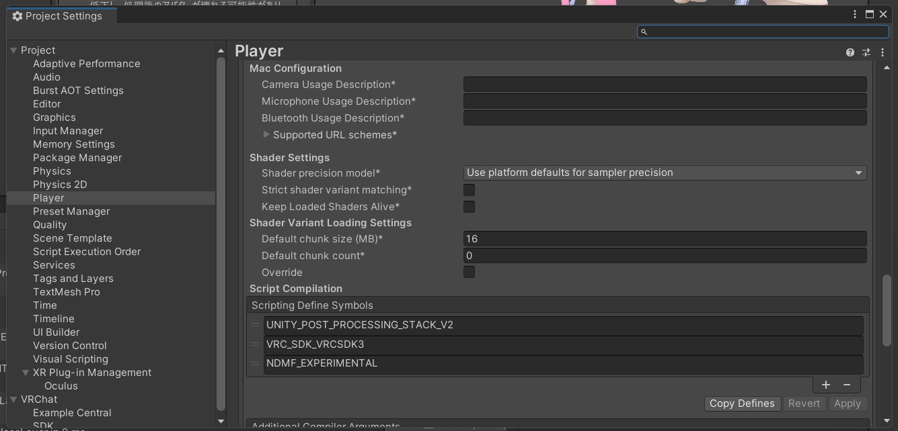

**This project is under heavy development. API and save file compatiblity is not guaranteed.**

This package provides support for building NDMF/Modular Avatar avatars for resonite, including
automatic conversion of VRC physbones.

To get started:
* Install ALCOM.
* Add https://vpm.nadena.dev/vpm-reso.json to your VPM sources.
* Install the `Modular Avatar - Resonite Support` package
* Enable NDMF_EXPERIMENTAL define:
  * In your unity project: Open Edit -> Project Settings.
  * Select Project -> Player, then open "Other settings".
  * In the "Scripting Define Symbols" field, add `NDMF_EXPERIMENTAL` to the list of defines.
    
* Open Tools -> NDM Framework -> NDMF Console
* Select your avatar, select Avatar Platform: Resonite, and click Build
* Once "build finished" appears, click "copy to clipboard", then select your resonite window, and press Ctrl-V

# 日本語版

**このプロジェクトは開発中です。APIやセーブファイルの互換性は保証されません。**

このパッケージは、Modular AvatarにResonite対応を追加するためのものです。
VRCの揺れもの設定の自動変換などにも対応しています。

セットアップ手順：
* ALCOMをインストールします。（VCCを使用しないでください）
* https://vpm.nadena.dev/vpm-reso.json をVPMのソースに追加します。
* `Modular Avatar - Resonite Support`パッケージをインストールします。
* NDMF_EXPERIMENTAL を有効にします：
  * Unityのプロジェクトで、Edit -> Project Settingsを開きます。
  * Project -> Playerを選択し、「Other settings」を開きます。
  * 「Scripting Define Symbols」フィールドに、`NDMF_EXPERIMENTAL`を追加します。
    
* Tools -> NDM Framework -> NDMF Consoleを開きます。
* アバターを選択し、Avatar Platform: Resoniteを選択してBuildをクリックします。
* 「build finished」と表示されたら、「copy to clipboard」をクリックし、Resoniteのウィンドウを選択してCtrl-Vを押します。